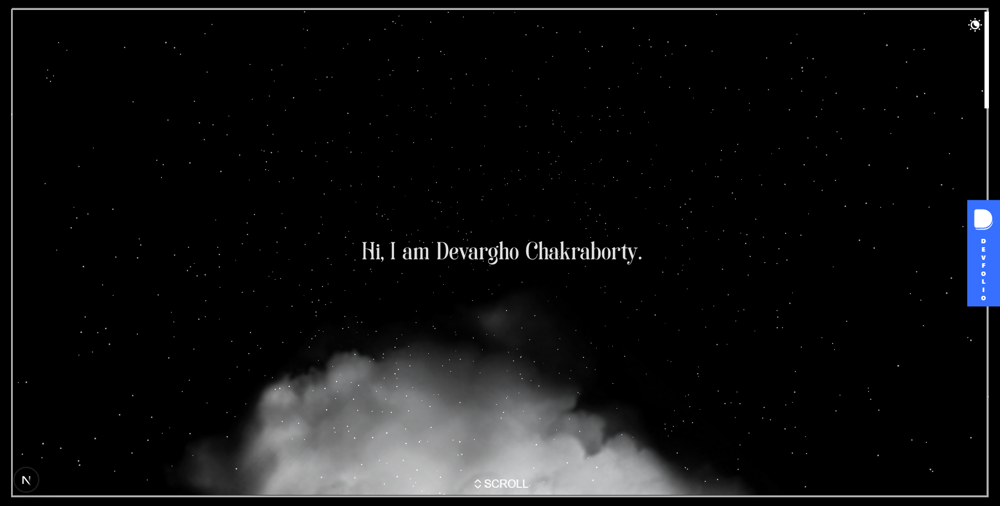

# devargho.github.io

> **3D Portfolio of Devargho Chakraborty** — Blockchain Developer | Full-Stack Engineer | Web3 Builder

A premium 3D interactive portfolio built with Next.js, React Three Fiber, GSAP, and Three.js. Features immersive WebGL scenes, scroll-driven animations, and portal-based navigation.

---

## 🚀 Live Preview

[](https://boredooms.github.io)

---

## 🧑‍💻 About

Hi! I'm **Devargho Chakraborty**, a 3rd year Computer Science student at Techno India University and an active Web3/blockchain developer. I've built and shipped projects across 15+ hackathons spanning 2024–2026.

- 🔗 **GitHub**: [github.com/Boredooms](https://github.com/Boredooms)
- 💼 **LinkedIn**: [linkedin.com/in/devargho](https://www.linkedin.com/in/devargho)
- 🌐 **Devfolio**: [devfolio.co/@DevarghoC](https://devfolio.co/@DevarghoC)
- 🐦 **X/Twitter**: [x.com/DevarghoC](https://x.com/DevarghoC)

---

## ✨ Features

- **3D WebGL Scene** — Caspar David Friedrich "Wanderer" model, clouds, starfield
- **Scroll-driven Animation** — GSAP + React Three Fiber ScrollControls
- **Portal Navigation** — Click-to-enter immersive portals for Work/Projects
- **3D Timeline** — Hackathon milestones rendered in Three.js space
- **Project Carousel** — Cylindrical 3D carousel for all projects
- **Devfolio Badge** — Live floating Devfolio brand badge
- **Theme Switcher** — Dark/light toggle with smooth GSAP color transitions
- **Responsive** — Mobile-optimized with touch pan controls

---

## 🛠 Tech Stack

| Layer | Technology |
|---|---|
| Framework | Next.js 16 (App Router) |
| 3D Rendering | React Three Fiber + Three.js + DREI |
| Animation | GSAP 3 |
| State | Zustand |
| Styling | Tailwind CSS v4 |
| Language | TypeScript |
| Deployment | Vercel |

---

## 📦 Local Development

```bash
# Install dependencies
npm install

# Run dev server
npm run dev

# Build for production
npm run build
```

Open [http://localhost:3000](http://localhost:3000) in your browser.

---

## ⚙️ Environment Variables

Set these in `.env.local` or in your Vercel project settings:

```env
NEXT_PUBLIC_GA_ID=G-XXXXXXXXXX        # Google Analytics ID (optional)
NEXT_PUBLIC_SITE_URL=https://yourdomain.com
```

---

## 🚢 Deployment

### Vercel (Recommended)

1. Push this repo to GitHub
2. Import the project at [vercel.com/new](https://vercel.com/new)
3. Set environment variables in the Vercel dashboard
4. Deploy — Vercel auto-detects Next.js

### GitHub Pages (Alternative)

The `.github/workflows/nextjs.yml` workflow auto-deploys to GitHub Pages on push to `main`. Set `GH_PAGES_CUSTOM_DOMAIN` secret for a custom domain.

> **Note**: For GitHub Pages, re-enable `output: 'export'` in `next.config.ts`.

---

## 🏆 Projects Featured

| Project | Description |
|---|---|
| **SwyftPay** | Escrow-backed crypto-to-INR payment platform on Polygon |
| **Proofly** | Privacy-first wallet for proving humanity & securing AI |
| **InfinityCare** | Decentralized healthcare data platform with AI summaries |
| **HireNexa** | Blockchain-powered AI recruitment & portfolio platform |
| **Silo Sentinel** | Crop infestation detection via ESP32 + TinyML |
| **Moodwave CLI** | Terminal-based mood-to-Spotify playlist generator |
| **BlissMusic** | Distributed music streaming platform with SoundCloud API |
| **StackForge** | AI-powered full-stack project scaffold generator |
| **ResQ** | AI emergency response and community reporting system |

---

## 📄 License

MIT — feel free to fork and build your own version. If you do, please credit the original template.
